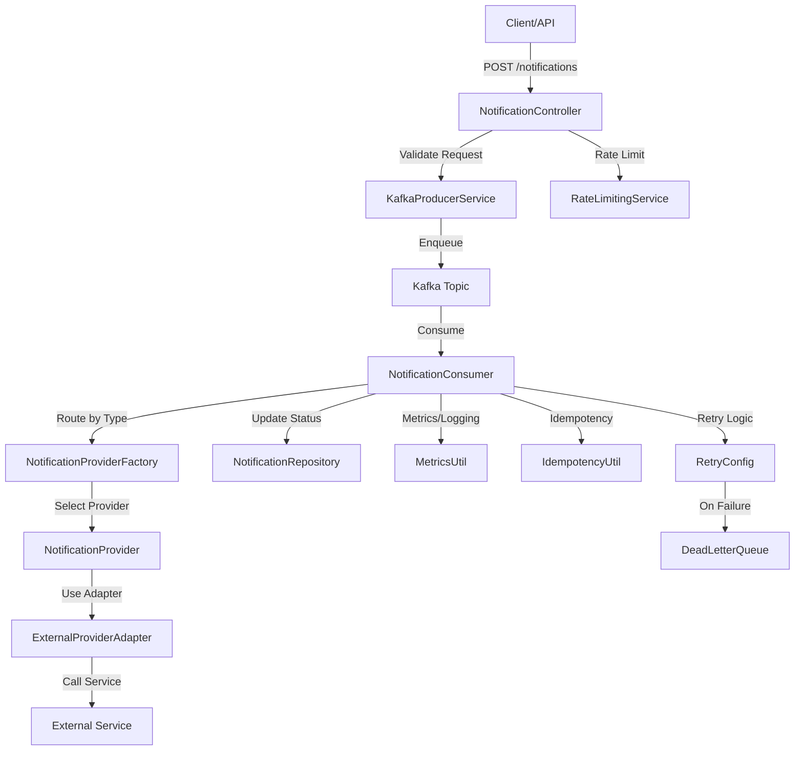

```mermaid
flowchart TD
    A[Client/API] -->|POST /notifications| B[NotificationController]
    B -->|Validate Request| C[KafkaProducerService]
    C -->|Enqueue| D[Kafka Topic]
    D -->|Consume| E[NotificationConsumer]
    E -->|Route by Type| F[NotificationProviderFactory]
    F -->|Select Provider| G[NotificationProvider]
    G -->|Use Adapter| H[ExternalProviderAdapter]
    H -->|Call Service| I[External Service]
    E -->|Update Status| J[NotificationRepository]
    E -->|Metrics/Logging| K[MetricsUtil]
    B -->|Rate Limit| L[RateLimitingService]
    E -->|Idempotency| M[IdempotencyUtil]
    E -->|Retry Logic| N[RetryConfig]
    N -->|On Failure| O[DeadLetterQueue]
```
