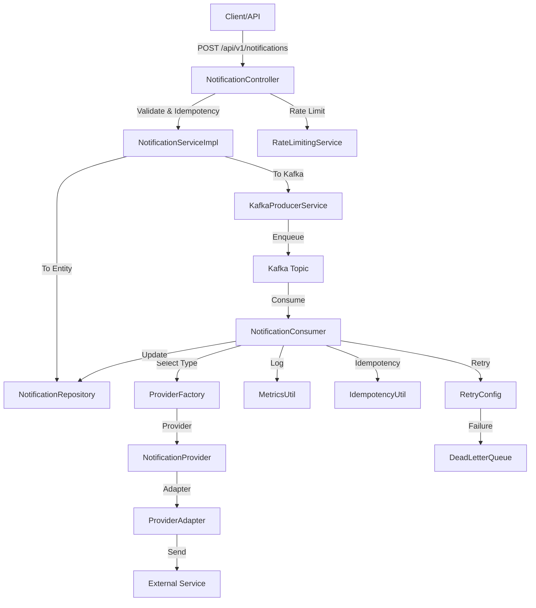

```mermaid
flowchart TD
    A[Client/API] -->|POST /api/v1/notifications| B[NotificationController]
    B -->|Validate & Idempotency| C[NotificationServiceImpl]
    C -->|To Entity| D[NotificationRepository]
    C -->|To Kafka| E[KafkaProducerService]
    E -->|Enqueue| F[Kafka Topic]
    F -->|Consume| G[NotificationConsumer]
    G -->|Select Type| H[ProviderFactory]
    H -->|Provider| I[NotificationProvider]
    I -->|Adapter| J[ProviderAdapter]
    J -->|Send| K[External Service]
    G -->|Update| D
    G -->|Log| L[MetricsUtil]
    B -->|Rate Limit| M[RateLimitingService]
    G -->|Idempotency| N[IdempotencyUtil]
    G -->|Retry| O[RetryConfig]
    O -->|Failure| P[DeadLetterQueue]
```
